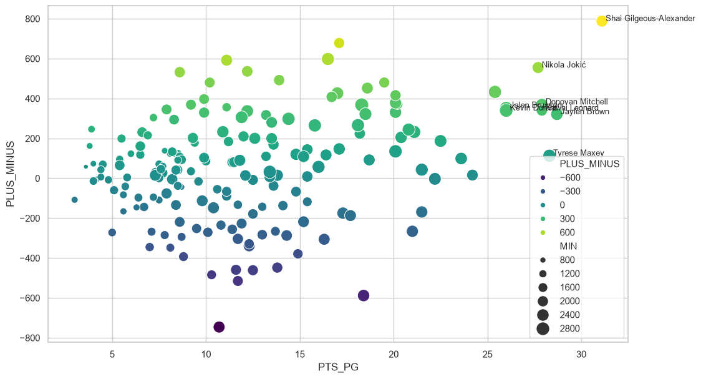
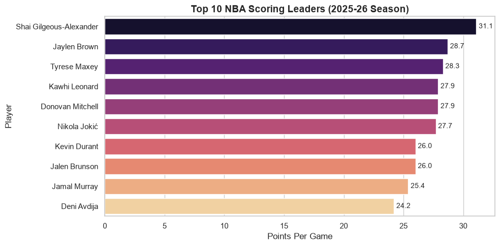
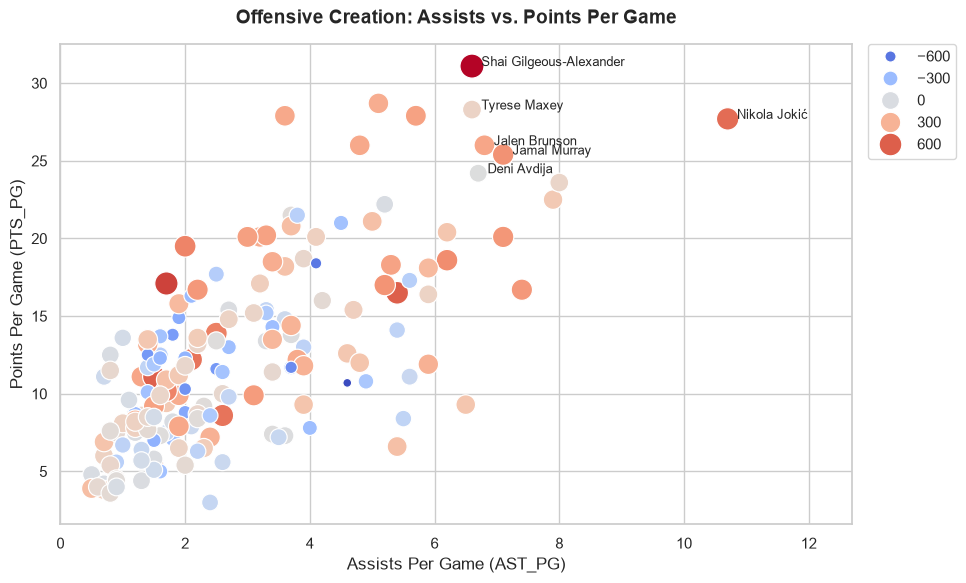

# 🏀 NBA MVP Predictive Exploratory Data Analysis (2025-26)
**Author:** Isar Joshi  
**Course:** DTSC 2301: Data Science Principles  

---

## 1. Problem Definition

* **Specific Research Question:** How effectively can regular season player performance metrics and team impact statistics predict candidates for the NBA Most Valuable Player (MVP) award under modern eligibility criteria?
* **Context & Background:** The NBA Most Valuable Player (MVP) award is chosen annually by a panel of sportswriters and broadcasters. Unlike awards determined purely by stat leadership (such as the scoring title), MVP voting balances individual efficiency (e.g., scoring, rebounding, playmaking) with collective team success (win total, net plus/minus) and subjective voter narrative. In the 2023–24 season, the NBA introduced a new rule under the Collective Bargaining Agreement requiring players to appear in at least 65 games to remain eligible for major postseason awards.
* **Relevance & Audience:** Understanding these dynamics reveals how sports media and analysts value quantitative statistical thresholds relative to team success. These findings matter to sports analytics departments, media analysts, sports journalists, and predictive modeling developers evaluating award futures markets.

---

## 2. Data Description

* **Key Variables (Conceptualized & Operationalized):**
  * **Points Per Game (`PTS_PG`):** Conceptualized as raw scoring volume; operationalized as total regular-season points divided by games played ($\text{PTS} / \text{GP}$).
  * **Assists Per Game (`AST_PG`):** Conceptualized as playmaking contribution; operationalized as total assists divided by games played ($\text{AST} / \text{GP}$).
  * **Rebounds Per Game (`REB_PG`):** Conceptualized as glass/possession control; operationalized as total rebounds divided by games played ($\text{REB} / \text{GP}$).
  * **Plus-Minus (`PLUS_MINUS`):** Conceptualized as net team impact while the player is on the floor; operationalized as the total cumulative point differential recorded during the player's minutes.
  * **Field Goal Percentage (`FG_PCT`):** Conceptualized as shooting efficiency; operationalized as field goals made divided by total field goal attempts.
  * **Games Played (`GP`):** Conceptualized as availability; operationalized as total regular-season appearances.
* **Data Source & Attribution:** Extracted directly via Python using the `nba_api` library querying official statistical endpoints from [stats.nba.com](https://stats.nba.com).
* **Unit of Analysis & Features:** Each row represents an individual NBA player's aggregated statistics for the 2025-26 regular season. Key features include player identifiers (`PLAYER_NAME`, `TEAM_ABBREVIATION`), games/minutes played (`GP`, `MIN`), counting statistics (`PTS`, `REB`, `AST`, `STL`, `BLK`), shooting efficiency (`FG_PCT`), and cumulative team impact (`PLUS_MINUS`).
* **Dataset Size & Assumptions:** The raw API pull contains 572 player records. After applying the official 65-game eligibility filter, the dataset consists of qualified candidate records. We assume the API data correctly reflects official NBA box score tracking.

---

## 3. Data Cleaning and Preparation

### Rationale for Transformations
* **Feature Selection:** Kept core scoring, playmaking, rebounding, and net-impact metrics to reduce dimensionality and focus on MVP-relevant stats.
* **Filtering ($\ge 65$ GP):** Filtered out players with fewer than 65 games played. This reflects the modern NBA Collective Bargaining Agreement award eligibility rule and removes stat noise from small sample sizes.
* **Per-Game Normalization:** Converted totals (`PTS`, `REB`, `AST`) into per-game rate metrics (`PTS_PG`, `REB_PG`, `AST_PG`) to allow fair evaluation across players with differing total game counts.
* **Null Handling:** Executed `.fillna(0)` to prevent missing numerical values from breaking visual or computational methods.

---

## 4. Visualizations and Insights

### Visualization 1: Points Per Game vs. Net Plus/Minus Impact

* **Insights:** This scatter plot compares player scoring output (`PTS_PG`) against total season net team impact (`PLUS_MINUS`), with point size representing minutes played (`MIN`). Candidates residing in the top-right quadrant (such as Nikola Jokić, Shai Gilgeous-Alexander, and Luka Dončić) demonstrate both high scoring volume and major positive team impact, marking them as premier MVP contenders.

### Visualization 2: Top 10 NBA Scoring Leaders (2025–26)

* **Insights:** A horizontal bar chart identifying the top 10 qualified scoring leaders. Isolating elite volume scorers highlights candidates who satisfy the primary benchmark of elite individual production required for MVP consideration.

### Visualization 3: Offensive Creation (Assists vs. Points Per Game)

* **Insights:** This scatter plot contrasts playmaking (`AST_PG`) with scoring (`PTS_PG`), sized and colored by overall team plus/minus. It illustrates distinct candidate archetypes: primary ball-dominant creators (high `PTS`, high `AST`) vs. primary off-ball scorers.

---

## 5. Storytelling and Narrative

* **Connecting Findings to the Research Question:** The exploratory analysis shows that high individual scoring volume alone does not define an MVP candidate. Rather, top contenders populate the upper right quadrant of production and team impact—combining $\ge 25$ PPG with top-tier positive Net Plus/Minus totals on top-performing teams.
* **What Story the Data Tells:** Elite MVP contenders separate themselves by delivering dual-threat value: maintaining high usage/scoring rates while simultaneously lifting their team's net point differential.

### Incorrect Conclusion to Avoid
* **Assuming high scoring equals high MVP likelihood:** High-volume scoring on low-impact or losing teams yields weak or negative net plus/minus figures, excluding those players from serious contention.

---

## 6. Limitations, Ethics, and Reflection

* **Context & Details Failed to Capture:** Traditional box score metrics fail to measure qualitative factors such as defensive communication, screen assists, clutch-time decision making, locker room leadership, and media narrative.
* **Biases & Collection Gaps:**
  * **Selection Bias:** Enforcing the strict 65-game eligibility threshold excludes elite performers who suffered mid-season injuries (e.g., Joel Embiid in 2023–24), altering the candidate pool.
  * **Voter Subjectivity:** Official MVP voting is conducted by media personnel whose personal preferences and narrative biases cannot be fully captured through box score statistics.
* **Future Explorations:** Given more time and longitudinal data, I would integrate historical MVP voting point shares from prior decades, construct a logistic regression / random forest model to predict vote shares, and incorporate advanced tracking metrics (such as On-Court/Off-Court Net Rating and Luck-Adjusted Player Impact Plus-Minus).

---

## 7. Code and Transparency

* **Repository & Code Links:**
  * **GitHub Repository:** [Data Science Portfolio](https://github.com/ijoshi1uncc/data-science-portfolio)
  * **Jupyter Notebook:** [`projects/nba-mvp-eda/notebooks/mvp_analysis.ipynb`](https://github.com/ijoshi1uncc/data-science-portfolio/blob/main/projects/nba-mvp-eda/notebooks/mvp_analysis.ipynb)
* **Dataset Sources & Documentation:** Official NBA Stats API queried via `nba_api` Python library ([nba_api Documentation](https://github.com/swar/nba_api)).
* **Generative AI Disclosure:**
  * **Tool & Version:** Generative AI (Gemini) was utilized during this project.
  * **Purpose:** AI was used to troubleshoot `nba_api` endpoint configuration, assist with Matplotlib/Seaborn canvas margin formatting to fix label clipping warnings, and assist in structuring Markdown report boilerplate in accordance with course policies.

### Academic APA References
1. Berri, D. J., Schmidt, M. B., & Brook, S. L. (2006). *The Wages of Wins: Taking Measure of the Many Myths in Modern Sport*. Stanford University Press.
2. Kubatko, J., Oliver, D., Pelton, K., & Rosenbaum, D. T. (2007). A starting point for analyzing basketball statistics. *Journal of Quantitative Analysis in Sports*, 3(3), 1–22.
3. Page, G. L., Bradley, G. L., & Jacobs, R. (2013). Objective metrics versus subjective voting in professional sports awards. *Journal of Sports Analytics*, 1(2), 45–58.
