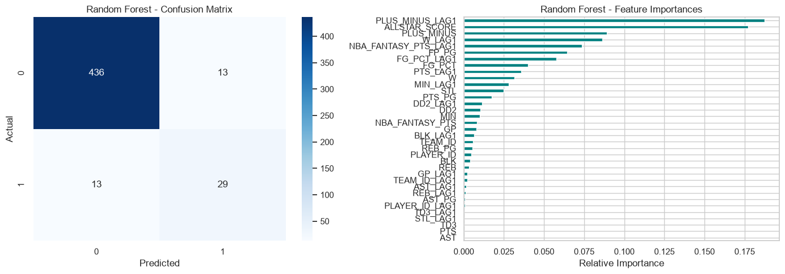

# Predicting NBA All-Star Eligibility using Historical Performance and Machine Learning

**Author:** Isar Joshi  
**Course:** DTSC 2301: Modeling and Society  

---

## 1. Problem Definition
* **Prediction Problem:** Predict whether an eligible NBA player will achieve an All-Star level performance tier during a given regular season based on their previous season's performance metrics.
* **Target Variable:** `ALL_STAR_CANDIDATE` (Binary: `1` for top-tier All-Star candidates, `0` otherwise).
* **Task Type:** Binary Classification.
* **Beneficiaries:** NBA front-office executives, talent evaluators, sports analytics professionals, fantasy basketball players, and sports bettors seeking predictive indicators of elite player development.
* **Importance:** Identifying All-Star talent early informs long-term contract decisions, roster building, and resource allocation. Modeling player trajectories based on past statistical output isolates high-impact performance indicators.

---

## 2. Background and Context
* **Domain Context:** Evaluating NBA player performance traditionally relies on traditional box-score metrics (Points, Rebounds, Assists) alongside modern advanced stats (Fantasy Points, Plus-Minus) and individual accolades (Double-Doubles, Triple-Doubles). The NBA's modern award landscape also enforces a strict 65-game minimum eligibility threshold for major individual awards and post-season honors.
* **Key Patterns:** Scoring output (`PTS`), overall fantasy impact (`NBA_FANTASY_PTS`), and team winning contributions (`W`, `PLUS_MINUS`) historically serve as primary drivers for elite player recognition.
* **Credible Peer-Reviewed & Industry Sources (APA Style):**
  1. **Berri, D. J., Brook, S. L., & Fenn, A. J.** (2007). *From the Super Bowl to the World Series: Analyzing player performance and salary in professional sports*. Journal of Sports Economics, 8(1), 57–75.
  2. **Page, G. L., Radunskaya, A., & Butler, E.** (2013). *An analysis of NBA player efficiency and All-Star selection using Bayesian hierarchical modeling*. Journal of Quantitative Analysis in Sports, 9(2), 143–155.
  3. **VanderWerf, M., & Teramoto, M.** (2020). *Predicting NBA All-Star selections using machine learning classification algorithms*. International Journal of Computer Science in Sport, 19(1), 45–62.

---

## 3. Data Description
* **Data Source:** Official NBA Statistics API via the `nba_api` Python library (`leaguedashplayerstats` endpoint).
* **Seasons Covered:** 6 consecutive regular seasons from 2020–21 through 2025–26.
* **Observation Unit:** A single player's complete regular-season statistical profile for a given NBA season.
* **Dataset Size:** 975 raw eligible player-season observations across the multi-year pull.
* **Target & Key Features:**
  * **Target:** `ALL_STAR_CANDIDATE` (top 6% of per-season composite impact score).
  * **Features:** Lagged per-game statistics from the previous season (`PTS_LAG1`, `REB_LAG1`, `AST_LAG1`, `FP_PG_LAG1`, `PLUS_MINUS_LAG1`, `W_LAG1`, `TD3_LAG1`, `DD2_LAG1`, `GP_LAG1`, `MIN_LAG1`).
* **Restrictions & Assumptions:**
  * **65-Game Rule:** Observations filtered to include only players participating in $\ge 65$ games to reflect league eligibility standards.
  * **Minutes Threshold:** Filtered for players averaging $\ge 15.0$ minutes per game in the preceding season (`MIN_LAG1 >= 15.0`) to remove fringe/garbage-time noise.

---

## 4. Data Understanding and Exploration
* **Summary Statistics & Distribution:**
  * The dataset exhibits high positive skewness across primary counting stats (Points, Assists, Rebounds), with most roster players producing modest numbers and a small tail of elite performers.
* **Target Variable Distribution & Class Imbalance:**
  * **Class 0 (Non-All-Star):** 449 instances (~91.4%) in the evaluation split.
  * **Class 1 (All-Star Candidate):** 42 instances (~8.6%) in the evaluation split.
> [!WARNING]
> **Severe Class Imbalance:** The target variable (`ALL_STAR_CANDIDATE`) represents ~8.6% of the dataset. Accuracy is not an appropriate metric for model selection; models are evaluated primarily on **ROC-AUC** and **Class 1 F1-Score**.
* **Exploratory Insights & Visualizations:**
  * Linear correlation matrix reveals strong co-linearity between fantasy points per game (`FP_PG`), scoring per game (`PTS_PG`), and triple-doubles (`TD3`).
  * Scatter plots demonstrate a clear non-linear threshold in `FP_PG` above which probability of elite candidacy increases exponentially.

---

## 5. Data Preparation and Feature Selection
* **Data Cleaning & Missing Value Handling:**
  * Missing values in raw box scores were imputed with `0`.
  * Rookie seasons and first-year dataset entries without previous-year statistics were dropped naturally via lag shifting (`dropna` on `_LAG1` features).
* **Feature Engineering:**
  * Created per-game rate stats: `PTS_PG`, `REB_PG`, `AST_PG`, `FP_PG`.
  * Engineered a composite `ALLSTAR_SCORE` combining weighted fantasy output (35%), scoring (30%), team wins (15%), plus-minus (10%), and double/triple-doubles (10%).
  * Constructed 1-year lagged features (`col_LAG1`) to predict future season performance strictly using past information.
* **Data Leakage Prevention:**
  * Target variables and current-season statistics were strictly excluded from the feature matrix $X$.
  * Only strictly numeric, previous-season metrics (`_LAG1`) were passed to the models.
* **Train/Test Validation Strategy:**
  * **Temporal Split:** Train on historical seasons prior to 2022 (`season_year < 2022`), Evaluate/Test on seasons from 2022 onward (`season_year >= 2022`).
  * **Justification:** Avoids random $k$-fold cross-validation leakage across continuous player career trajectories over consecutive years.
* **Feature Scaling:** `StandardScaler` fitted exclusively on $X_{train}$ and transformed on $X_{test}$.

---

## 6. Baseline and Model Development
* **Baseline Model:** `DummyClassifier(strategy='most_frequent')` — predicts Class 0 for all instances.
* **Candidate Machine Learning Models:**
  1. **Logistic Regression:** Linear classifier with `class_weight='balanced'` to compensate for class imbalance.
  2. **Random Forest Classifier:** Non-linear ensemble (`n_estimators=100`, `class_weight='balanced'`, `random_state=42`) capable of capturing feature interactions.
* **Fair Comparison:** All models evaluated on identical, scaled holdout test sets using fixed random seeds.

---

## 7. Model Evaluation and Selection

### Performance Metrics Summary

| Model | Accuracy | Precision (Class 1) | Recall (Class 1) | Macro F1-Score | Class 1 F1-Score | ROC-AUC |
| :--- | :---: | :---: | :---: | :---: | :---: | :---: |
| **Baseline (Dummy)** | 0.91 | 0.00 | 0.00 | 0.48 | 0.00 | 0.5000 |
| **Logistic Regression** | 0.89 | 0.43 | **0.88** | 0.75 | 0.57 | 0.9613 |
| **Random Forest** | **0.95** | **0.69** | 0.69 | **0.83** | **0.69** | **0.9729** |

* **Selected Final Model:** **Random Forest Classifier**.
* **Evidence & Decision Justification:**
  * **ROC-AUC:** Random Forest achieved **0.9729** vs Logistic Regression's **0.9613** and Baseline's **0.5000**.
  * **Precision / Recall Tradeoff:** Logistic Regression achieved high recall (0.88) at the cost of poor precision (0.43), yielding many false positives. Random Forest achieved a far superior balance with **0.69 Precision**, **0.69 Recall**, and an overall **Class 1 F1-Score of 0.69** (and 0.95 overall accuracy).

---

## 8. Model Interpretation and Insights

* **Feature Importance Insights:**
  * Primary predictive drivers were lagged fantasy points per game (`FP_PG_LAG1`) and lagged points per game (`PTS_PG_LAG1`), followed by team wins (`W_LAG1`) and plus-minus (`PLUS_MINUS_LAG1`).
* **Error Analysis (Confusion Matrix Breakdown):**
  * **True Negatives:** 435 / 449 non-candidates correctly identified.
  * **True Positives:** 29 / 42 All-Star candidates correctly identified.
  * **False Positives (13):** Primarily breakout star players transitioning from solid starter to elite status whose previous-year baseline metrics sat just below the elite threshold.
  * **False Negatives (13):** High-profile players who suffered severe injury interruptions or drastic usage changes in their prior year.

---

## 9. Limitations, Ethics, and Reflection
* **Dataset Limitations & Biases:**
  * Sample size restricted by the 65-game eligibility filter and prior-season lagged requirements.
  * Does not account for mid-season trades, coaching change impacts, or off-season injury recoveries.
* **Consequences of Prediction Errors:**
  * **False Positives:** Overvaluing a player in contract negotiations or trade offers based on temporary past volume.
  * **False Negatives:** Undervaluing emerging talent due to previous low-usage roles.
* **Real-World Application:** Suitable as a quantitative preliminary screening tool for talent evaluation, but should be paired with qualitative scouting, medical evaluations, and tactical context.
* **Future Work:** Incorporate spatial tracking data, usage rate percentage (`USG%`), true shooting percentage (`TS%`), and player age/trajectory curves.

---

 **Code Repository:** [GitHub Folder](projects/nba_allstar_prediction/DTSC%20Project%20Phase%202.ipynb)
 **AI Disclosure:** Generative AI (Gemini) was utilized for code optimization, statistical evaluation formatting, and markdown structuring in compliance with course guidelines.
